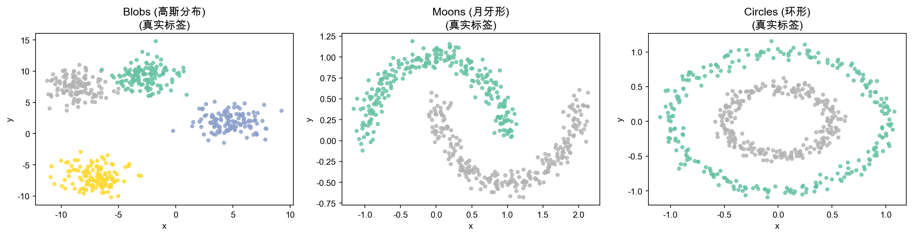
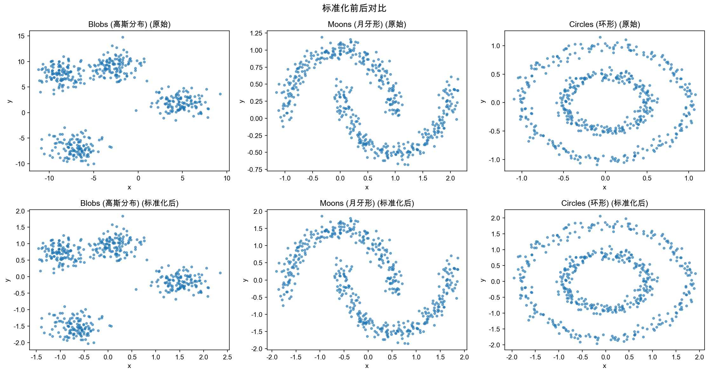

# 聚类算法实验报告

## 一、实验目的

1. 掌握常见聚类算法（K-means、DBSCAN、层次聚类）的基本原理、实现流程及优缺点
2. 通过编程实践理解不同聚类算法的适用场景
3. 对比分析不同聚类算法在多种数据类型上的性能差异
4. 提升数据预处理、结果可视化和算法调参的能力

## 二、算法与数据集描述

### 2.1 算法原理

**K-means 聚类**

K-means 是一种基于划分的聚类方法。通过迭代优化，将数据点分配到 K 个簇中，使得簇内误差平方和（SSE）最小。算法步骤：
1. 随机初始化 K 个簇中心
2. 将每个点分配到最近的簇中心
3. 重新计算每个簇的中心（均值）
4. 重复步骤 2-3 直到收敛

- **优点**：简单高效，可解释性强，适合大规模数据
- **缺点**：需预设 K 值，只能发现球状簇，对初始中心敏感

**DBSCAN 密度聚类**

DBSCAN 基于密度的空间聚类算法，通过密度连通性发现任意形状的簇。核心概念：
- ε-邻域：以某点为中心、半径为 eps 的区域
- 核心点：ε-邻域内包含至少 min_samples 个点
- 密度可达：通过核心点链连接的簇

- **优点**：可以发现任意形状簇，自动识别噪声点，无需预设簇数
- **缺点**：对参数 eps 和 min_samples 敏感，密度不均匀时效果差

**层次聚类 (Agglomerative Clustering)**

自底向上的凝聚层次聚类，将每个点视为一个簇，逐步合并最近的簇，直到达到指定簇数。不同连接方式（linkage）决定簇间距离计算：
- **Ward**：最小化合并后的簇内方差增量
- **Average**：两簇所有点对距离的平均
- **Complete**：两簇最远点对的距离

- **优点**：无需预设簇数（可用树状图选择），层次关系直观
- **缺点**：计算复杂度 O(n³)，合并决策不可逆

### 2.2 数据集描述

| 数据集 | 生成方法 | 特征 | 适用场景 |
|--------|----------|------|----------|
| Blobs (高斯分布) | `make_blobs` (4 centers, std=1.5) | 球状簇，线性可分 | 验证标准聚类，K-means 最优 |
| Moons (月牙形) | `make_moons` (noise=0.08) | 两个交错月牙形状，非凸 | 测试非凸形状处理能力 |
| Circles (环形) | `make_circles` (noise=0.05, factor=0.5) | 同心圆结构，内外嵌套 | 测试环形/嵌套结构处理能力 |

每个数据集包含 500 个样本，使用 `StandardScaler` 进行 Z-score 标准化预处理。

## 三、实验方案

### 3.1 实验流程

1. **数据生成**：使用 sklearn 生成三种合成数据集，设置 `random_state=42`
2. **数据预处理**：`StandardScaler` 标准化，可视化标准化前后对比
3. **K-means 聚类**：肘部法则选 K（1~10），输出 SSE 曲线和聚类结果
4. **DBSCAN 聚类**：网格搜索 eps=[0.1,0.2,0.3,0.5,0.8,1.0] × min_samples=[3,5,10,15]，选最优轮廓系数
5. **层次聚类**：对比 ward/average/complete 三种 linkage，绘制树状图
6. **性能对比**：统一使用轮廓系数和 Calinski-Harabasz 指数评估

### 3.2 参数调优策略

- **K-means**：肘部法则自动选择 K 值（最大曲率法）
- **DBSCAN**：网格搜索，选择轮廓系数最高的参数组合
- **层次聚类**：使用肘部法则确定的 K 值，对比三种 linkage 的轮廓系数

### 3.3 实验环境

- Python: 3.10.18
- NumPy: 2.2.6
- Matplotlib: 3.10.8
- Scikit-learn: 1.7.2
- SciPy: 1.15.3

## 四、程序清单

| 模块 | 功能说明 |
|------|----------|
| 环境准备与导入库 | 导入 numpy、matplotlib、sklearn 等库，设置中文显示和随机种子 |
| 数据生成 | 调用 `make_blobs`、`make_moons`、`make_circles` 生成数据集 |
| 数据预处理 | `StandardScaler` 标准化，绘制标准化前后对比图 → `scaling_comparison.png` |
| K-means 肘部法则 | `plot_elbow()` 函数绘制 SSE 曲线，自动找肘部点 → `elbow_*.png` |
| K-means 聚类 | `run_kmeans()` 执行聚类、计算指标、可视化（含簇中心标注）→ `kmeans_*.png` |
| DBSCAN 参数搜索 | `run_dbscan_grid()` 网格搜索最优参数，打印参数对比表 |
| DBSCAN 可视化 | 三数据集聚类效果图，噪声点用 × 标记 → `dbscan_all.png` |
| 层次聚类 | 对比三种 linkage，`run_agg()` 计算指标 |
| 层次聚类可视化 | 聚类散点图 → `agg_all.png`；树状图 → `dendrograms.png` |
| 性能汇总 | pandas DataFrame 汇总三种算法在三个数据集上的 Silhouette 和 CH 指数 |

## 五、实验结果

### 5.1 原始数据与预处理

三种数据集展示了完全不同的空间结构：Blobs 呈高斯球状分布（4个簇），Moons 为月牙形交错，Circles 为同心圆嵌套。

标准化前后数据分布形态不变（只改变尺度和中心位置），保证了聚类算法在统一尺度下工作。

### 5.2 K-means 聚类结果

| 数据集 | 最佳 K | Silhouette | CH Index |
|--------|--------|------------|----------|
| Blobs (高斯分布) | ~4 | 0.696 | 1503.6 |
| Moons (月牙形) | ~2 | 0.493 | 690.2 |
| Circles (环形) | ~2 | 0.385 | 393.3 |

**分析**：K-means 在 Blobs 上表现最佳（Sil=0.696），因为数据天然为球状簇。Moons 和 Circles 的指标较低，因为 K-means 基于欧氏距离划分，无法捕捉非凸/环形结构。

### 5.3 DBSCAN 聚类结果

| 数据集 | 最优 eps | 最优 min_samples | 簇数 | 噪声点数 | Silhouette | CH Index |
|--------|----------|-----------------|------|---------|------------|----------|
| Blobs | 0.3 | 10 | 3 | 4 | 0.662 | 953.6 |
| Moons | 0.3 | 3 | 2 | 0 | 0.384 | 430.9 |
| Circles | 0.2 | 5 | 5 | 3 | 0.118 | 93.0 |

**分析**：DBSCAN 在 Moons 上能识别非凸形状的 2 个簇。在 Circles 上，DBSCAN 识别出多个小簇，因为同心圆结构在密度空间中需要精细的 eps 调节。在 Blobs 上 DBSCAN 略逊于 K-means，因为密度聚类对参数更敏感。

### 5.4 层次聚类结果

| 数据集 | 最优 Linkage | Silhouette | CH Index |
|--------|-------------|------------|----------|
| Blobs | Ward | 0.696 | 1503.6 |
| Moons | Average | 0.459 | 570.1 |
| Circles | Average | 0.359 | 351.8 |

**分析**：Blobs 上三种 linkage 结果一致（Ward/Average/Complete 的 Sil 均为 0.696），因为球状簇结构清晰。Moons 和 Circles 上 Average linkage 稍优，因为它对非凸形状更宽容。

### 5.5 性能对比汇总

| 数据集 | K-means Sil | K-means CH | DBSCAN Sil | DBSCAN CH | Agglo Sil | Agglo CH |
|--------|-------------|------------|------------|-----------|-----------|----------|
| Blobs (高斯分布) | **0.696** | 1503.6 | 0.662 | 953.6 | **0.696** | 1503.6 |
| Moons (月牙形) | 0.493 | 690.2 | 0.384 | 430.9 | **0.459** | 570.1 |
| Circles (环形) | 0.385 | 393.3 | 0.118 | 93.0 | **0.359** | 351.8 |

> 注：加粗为每个数据集上的最佳 Silhouette 值。

### 5.6 可视化结果

- 肘部法则曲线：`./figures/elbow_*.png`
- K-means 聚类结果（含簇中心）：`./figures/kmeans_*.png`
- DBSCAN 聚类结果（含噪声标记）：`./figures/dbscan_all.png`
- 层次聚类结果：`./figures/agg_all.png`
- 树状图：`./figures/dendrograms.png`

## 六、疑难小结

### 6.1 实验中遇到的问题

1. **DBSCAN 参数调优**：Circles 数据在默认参数下很难找到正确的 2 个环，需精细调整 eps。经网格搜索发现，eps=0.2 时产生了 5 个不完美的小簇，而非 2 个完整环——这是密度聚类在同心圆结构上的固有限制。
2. **指标的选择**：CH 指数在 DBSCAN 中有时为 0（仅 1 个簇时），因为 CH 要求至少 2 个簇。轮廓系数在噪声点较多时也会受影响。
3. **链接方式差异**：Blobs 上三种 linkage 结果完全相同，说明对于球状分离良好的数据，linkage 选择不重要；但对 Moons/Circles，Average 略优于 Ward。

### 6.2 心得体会

1. 没有"万能"的聚类算法——算法选择取决于数据的几何结构和先验知识
2. 数据预处理（标准化）对基于距离的算法（K-means、层次聚类）至关重要
3. 参数调优是聚类分析的核心环节，特别是 DBSCAN 的 eps 和 min_samples
4. 轮廓系数和 CH 指数应结合使用，单一指标可能给出误导性结论

### 6.3 算法适用场景与局限性

| 算法 | 最佳场景 | 局限性 |
|------|----------|--------|
| K-means | 数据近似球形分布，簇数已知 | 不能处理非凸形状，需要预设 K |
| DBSCAN | 空间数据、任意形状簇、含噪声数据 | 参数敏感，密度差异大时效果差 |
| 层次聚类 | 需要探索簇的层次结构，小规模数据 | 大数据集计算开销大，合并不可逆 |

### 6.4 结论

- 对于**高斯分布**的球状数据，K-means 和层次聚类（Ward linkage）是最优选择
- 对于**非凸形状**数据（Moons、Circles），DBSCAN 在理论上更适合，但需要仔细调参
- 层次聚类提供了最丰富的结构信息（树状图），适合探索性分析
