# SVM支持向量机实验报告

---

## 1. 算法描述与实验方案

### 1.1 SVM 原理简介

支持向量机（Support Vector Machine, SVM）是一种二分类模型，其核心思想是在特征空间中寻找一个最优超平面，使得不同类别的样本之间的间隔（margin）最大化。SVM 的关键概念包括：

- **支持向量**：距离最优超平面最近的训练样本点，它们决定了超平面的位置。
- **软间隔**：引入松弛变量允许少量样本被误分类，通过参数 C 控制间隔大小与误分类惩罚的权衡。
- **核函数**：通过非线性映射将原始特征空间映射到高维空间，使线性不可分的问题变得线性可分。
  - **线性核**：$K(x_i, x_j) = x_i^T x_j$，适用于线性可分数据。
  - **多项式核**：$K(x_i, x_j) = (\gamma x_i^T x_j + r)^d$，引入多项式特征交互。
  - **RBF核（高斯核）**：$K(x_i, x_j) = \exp(-\gamma \|x_i - x_j\|^2)$，最常用的核函数，能将数据映射到无穷维空间。

### 1.2 数据集说明

| 属性     | Iris                               | Breast Cancer                       |
| -------- | ---------------------------------- | ----------------------------------- |
| 样本数   | 150                                | 569                                 |
| 特征数   | 4（花萼长度/宽度、花瓣长度/宽度）  | 30（细胞核形态学特征）              |
| 类别数   | 3（setosa, versicolor, virginica） | 2（恶性, 良性）                     |
| 数据特点 | 线性可分                           | 非线性可分                          |
| 来源     | sklearn.datasets.load_iris         | sklearn.datasets.load_breast_cancer |

### 1.3 实验设计

1. **数据预处理**：使用 StandardScaler 对特征进行标准化（均值为0，标准差为1），按 7:3 划分训练集/测试集（stratify 保持类别比例）。
2. **模型训练**：分别使用线性核、多项式核（degree=3）、RBF 核训练 SVC 模型，评估分类准确率、混淆矩阵、precision/recall/f1-score。
3. **超参数调优**：对 RBF 核使用 GridSearchCV 进行 5 折交叉验证网格搜索，搜索范围 C=[0.1, 1, 10, 100], gamma=[0.001, 0.01, 0.1, 1]。
4. **可视化**：散点图、类别分布图、相关热力图、混淆矩阵、超参数热力图、调优前后对比图、决策边界图。

---

## 2. 程序清单

### 2.1 环境准备与数据加载

```python
import numpy as np
import pandas as pd
import matplotlib.pyplot as plt
import seaborn as sns
from sklearn import datasets
from sklearn.model_selection import train_test_split, GridSearchCV
from sklearn.preprocessing import StandardScaler
from sklearn.svm import SVC
from sklearn.metrics import (classification_report, confusion_matrix, accuracy_score)

np.random.seed(42)
plt.rcParams['font.sans-serif'] = ['Arial Unicode MS', 'SimHei']
plt.rcParams['axes.unicode_minus'] = False

# 加载数据集
iris = datasets.load_iris()
cancer = datasets.load_breast_cancer()
```

### 2.2 数据预处理

```python
# 标准化
scaler_iris = StandardScaler()
X_iris_scaled = scaler_iris.fit_transform(iris.data)

# 划分训练集/测试集
X_iris_train, X_iris_test, y_iris_train, y_iris_test = train_test_split(
    X_iris_scaled, iris.target, test_size=0.3, random_state=42, stratify=iris.target)
```

### 2.3 模型训练与评估

```python
# 训练三种核函数的 SVM
for k in ['linear', 'poly', 'rbf']:
    model = SVC(kernel=k, random_state=42)
    model.fit(X_train, y_train)
    y_pred = model.predict(X_test)
    print(f'{k} SVM 准确率: {accuracy_score(y_test, y_pred):.4f}')
    print(classification_report(y_test, y_pred))
```

### 2.4 超参数调优

```python
param_grid = {'C': [0.1, 1, 10, 100], 'gamma': [0.001, 0.01, 0.1, 1]}
grid = GridSearchCV(SVC(kernel='rbf', random_state=42), param_grid, cv=5, scoring='accuracy')
grid.fit(X_train, y_train)
print(f'最佳参数: {grid.best_params_}')
print(f'最佳交叉验证准确率: {grid.best_score_:.4f}')
```

### 2.5 决策边界可视化

```python
def plot_decision_boundary(model, X, y, title, save_name):
    # 创建网格
    xx, yy = np.meshgrid(np.arange(x_min, x_max, h), np.arange(y_min, y_max, h))
    Z = model.predict(np.c_[xx.ravel(), yy.ravel()]).reshape(xx.shape)
    # 绘制决策区域和样本点
    ax.contourf(xx, yy, Z, alpha=0.3, cmap='RdYlBu')
    ax.scatter(X[:, 0], X[:, 1], c=y, cmap='RdYlBu', edgecolors='k')
    # 标记支持向量
    ax.scatter(model.support_vectors_[:, 0], model.support_vectors_[:, 1],
               s=150, facecolors='none', edgecolors='green', linewidth=2)
```

---

## 3. 实验结果

### 3.1 数据分布可视化

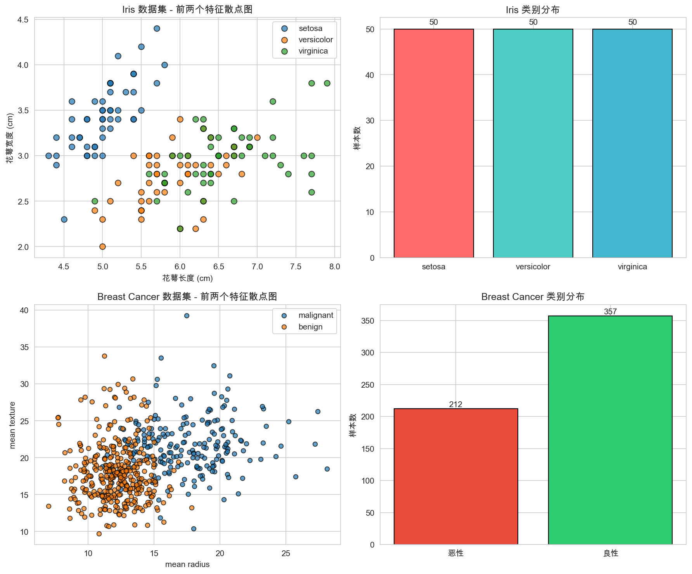

Iris 数据集在花萼长度-宽度平面上呈现较明显的类别分离（尤其是 setosa 类），而 Breast Cancer 数据集中两类在前两个特征上有重叠，说明线性不可分。

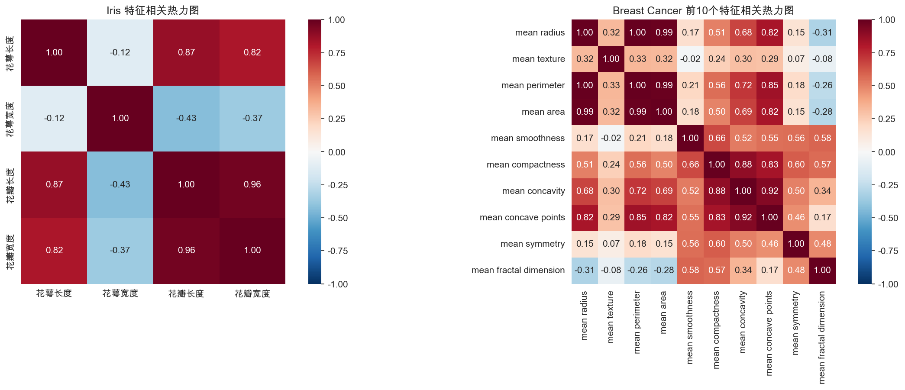

Iris 数据集中花瓣长度与花瓣宽度高度正相关（>0.96），花萼特征之间的相关性较弱。Breast Cancer 前 10 个特征之间存在不同程度的正负相关。

### 3.2 模型评估结果

#### Iris 数据集

| 核函数           | 准确率 |
| ---------------- | ------ |
| Linear           | 91.11% |
| Polynomial (d=3) | 86.67% |
| RBF              | 91.11% |


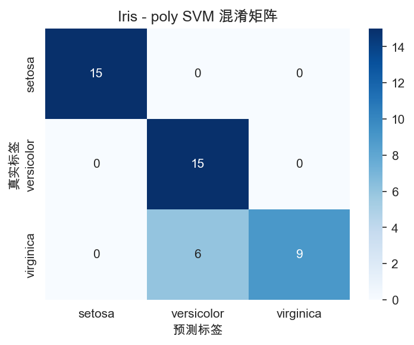
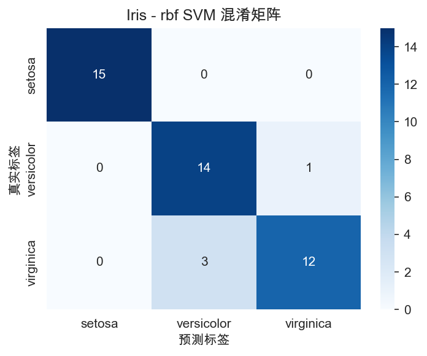

分类报告显示，Linear SVM 和 RBF SVM 对 setosa 类（precision=1.00, recall=1.00）的识别率完美，versicolor 和 virginica 之间存在少量混淆。

#### Breast Cancer 数据集

| 核函数           | 准确率 |
| ---------------- | ------ |
| Linear           | 98.25% |
| Polynomial (d=3) | 89.47% |
| RBF              | 97.66% |

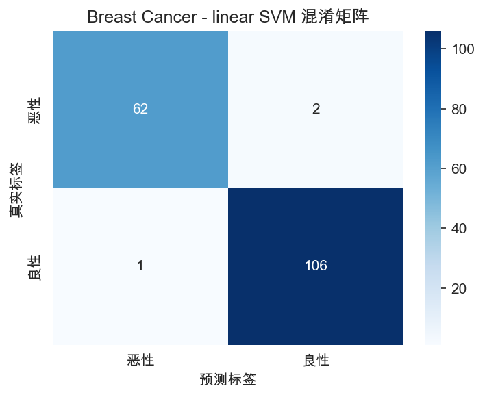
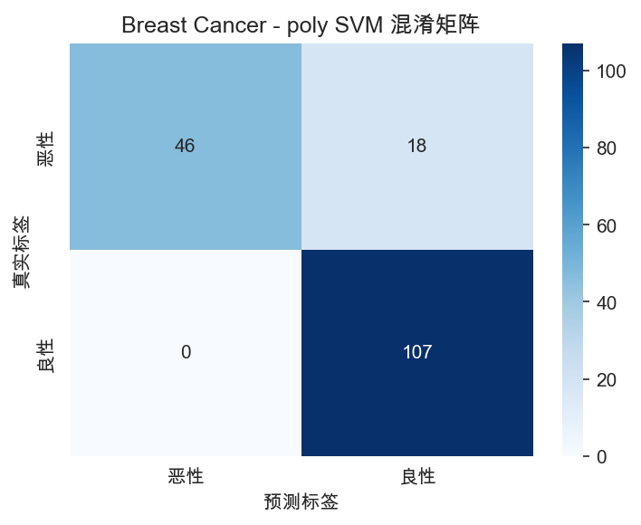
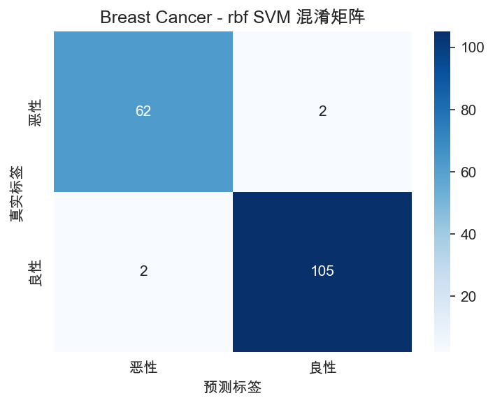

Breast Cancer 数据集上 Linear SVM 达到最高准确率 98.25%，precision=0.98, recall=0.97（恶性），说明在该高维特征空间中，线性分类器已经足够。

#### 横向对比

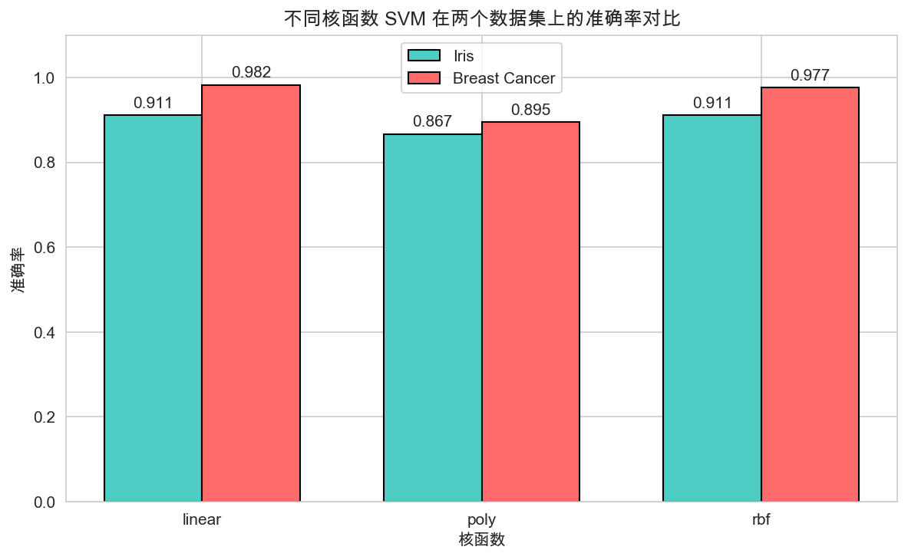

### 3.3 超参数调优结果

#### Iris — RBF SVM 网格搜索

- **最佳参数**: C=1, gamma=0.1
- **最佳交叉验证准确率**: 98.10%

|             | C=0.1  | C=1              | C=10   | C=100  |
| ----------- | ------ | ---------------- | ------ | ------ |
| gamma=0.001 | 0.3619 | 0.3619           | 0.3619 | 0.3619 |
| gamma=0.01  | 0.3619 | 0.8762           | 0.8762 | 0.8762 |
| gamma=0.1   | 0.9333 | **0.9810** | 0.9429 | 0.9429 |
| gamma=1     | 0.9714 | 0.9429           | 0.9429 | 0.9429 |

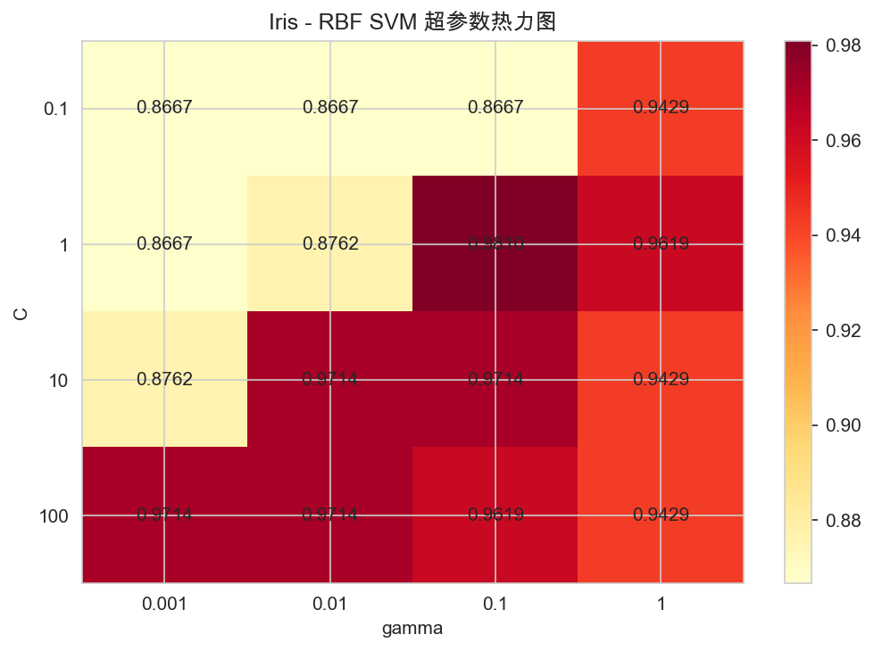

#### Breast Cancer — RBF SVM 网格搜索

- **最佳参数**: C=10, gamma=0.001
- **最佳交叉验证准确率**: 97.74%

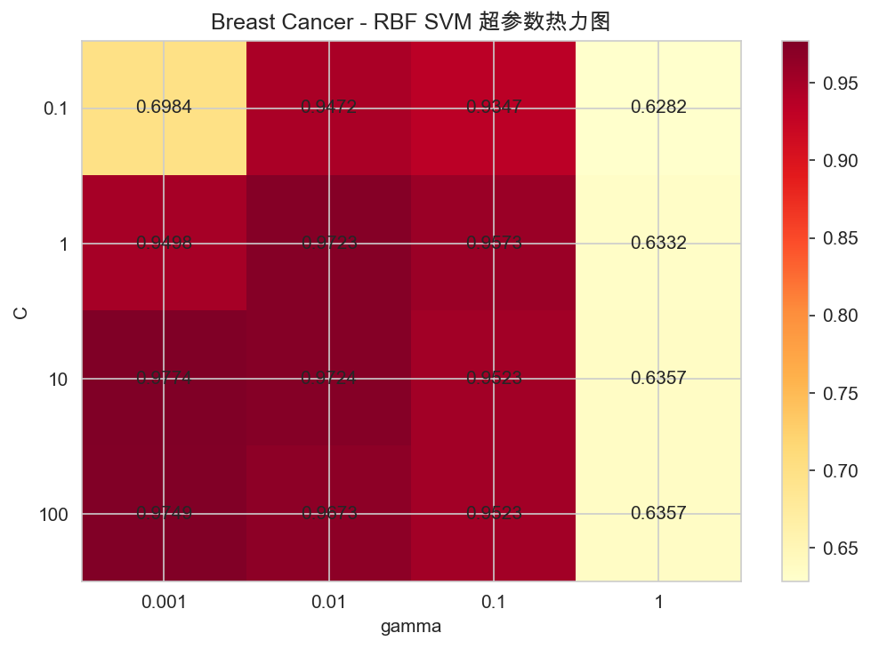

#### 调优前后对比

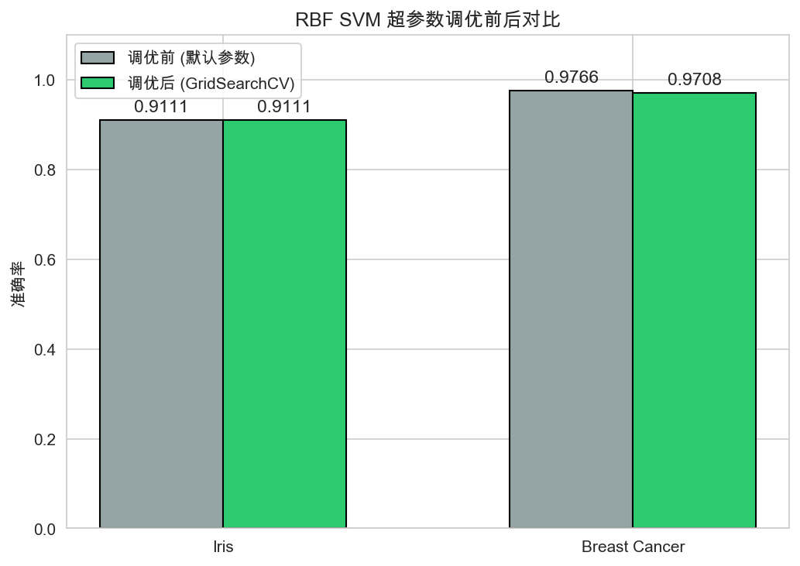

### 3.4 决策边界可视化

在 Iris 数据集前两个特征上绘制的决策边界和支持向量：

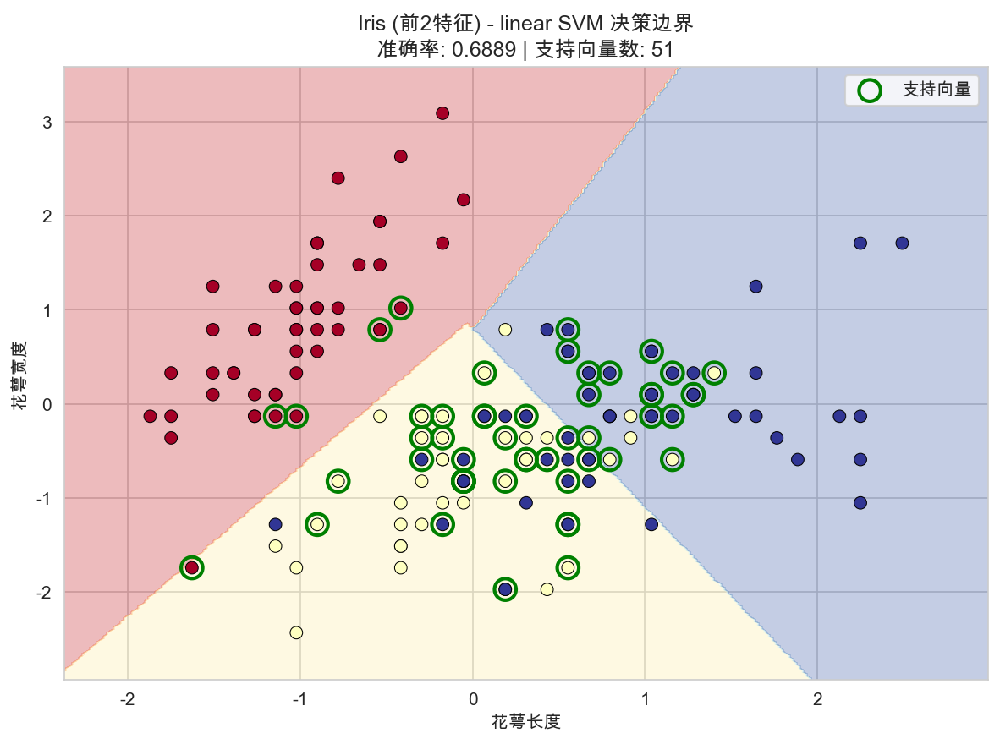
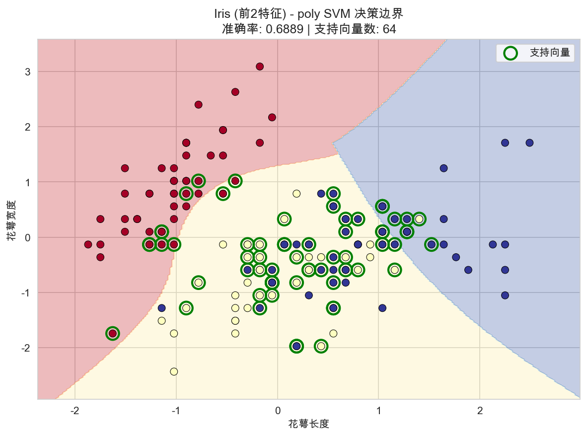
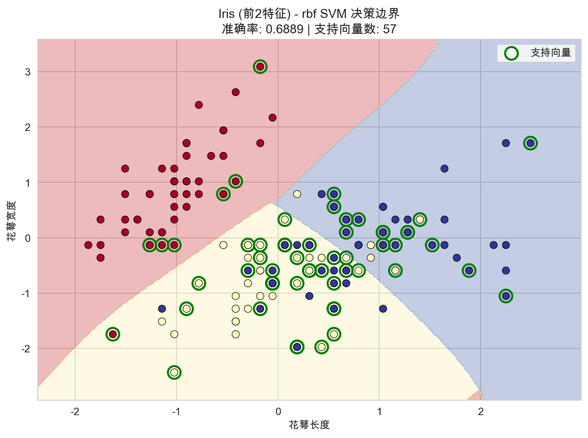

- Linear SVM 产生直线决策边界，支持向量较少（位于边界附近）。
- Polynomial SVM 产生弯曲的决策边界，但仅用前两个特征时容易过拟合。
- RBF SVM 产生封闭的决策区域，能将 setosa 完美分离，支持向量分布均匀。

---

## 4. 疑难小结

### 4.1 实验中遇到的问题

1. **特征标准化的必要性**：尝试未标准化的数据直接训练 SVM 时，准确率显著下降。SVM 基于样本间的距离/内积，如果不同特征的量纲差异过大，会严重影响模型性能。
2. **Polynomial SVM 在 Iris 上的表现不佳**：多项式核（d=3）在 Iris 数据集上的准确率（86.67%）低于线性核（91.11%），可能原因是 Iris 数据本身接近线性可分，引入多项式映射反而增加了模型的复杂度，导致一定的过拟合。
3. **网格搜索中的 gamma 取值**：当 gamma=0.001 时，Iris 数据集上的交叉验证准确率仅为 36.19%，说明 gamma 过小导致 RBF 核退化为近似线性核，在仅用前两个特征的场景下效果很差。
4. **中文显示问题**：macOS 上需要使用 'Arial Unicode MS' 或 'SimHei' 字体才能正确显示中文标签。

### 4.2 心得体会

- SVM 是一个强大且理论基础扎实的分类算法，在小样本、高维数据上表现优越。
- 核函数的选择和超参数调优是 SVM 应用中的关键步骤。RBF 核作为默认选择通常是好的起点，但不同数据集的最优配置差异较大（如 Iris 最优 gamma=0.1，Cancer 最优 gamma=0.001）。
- 交叉验证是超参数选择中不可或缺的工具，能有效避免在测试集上过拟合。
- 决策边界可视化对理解不同核函数的行为非常有帮助。

### 4.3 算法适用场景总结

| 场景                       | 推荐                            |
| -------------------------- | ------------------------------- |
| 线性可分数据               | Linear SVM                      |
| 一般非线性数据             | RBF SVM + GridSearchCV          |
| 已知特征交互模式           | Polynomial SVM                  |
| 大规模数据集               | 考虑 LinearSVC 或 SGDClassifier |
| 高维稀疏数据（如文本分类） | Linear SVM                      |
| 类别不平衡                 | 设置 class_weight='balanced'    |
