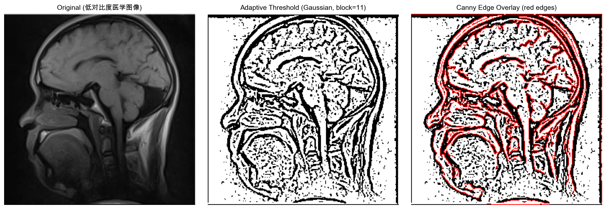
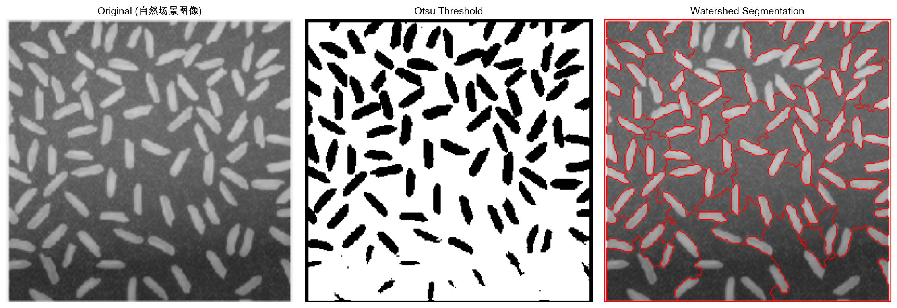
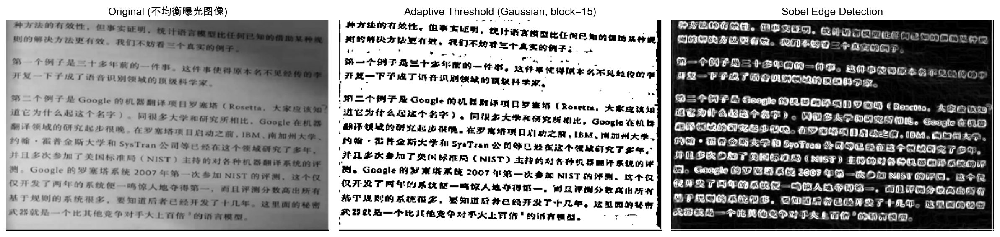
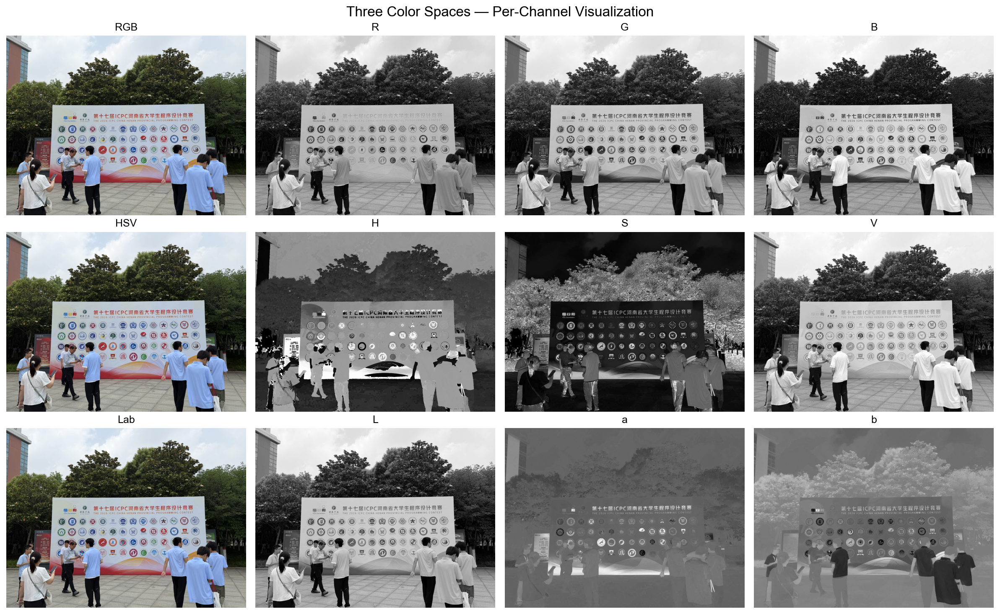
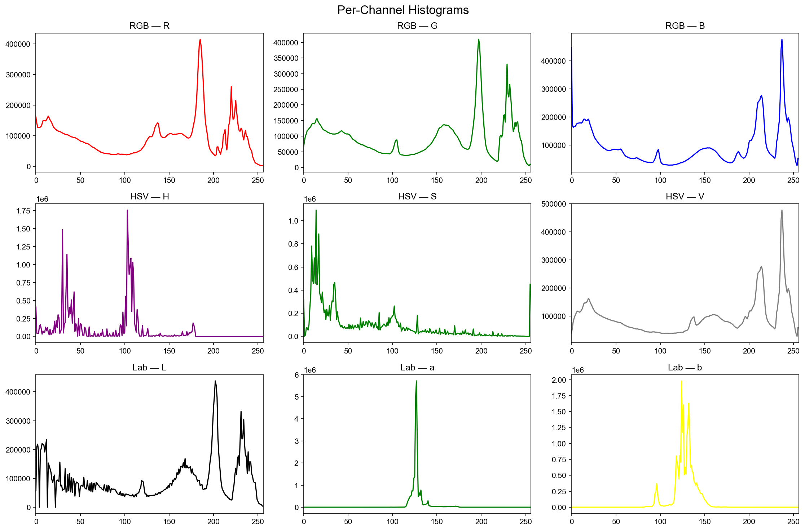
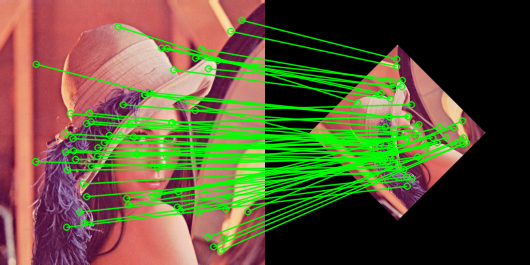
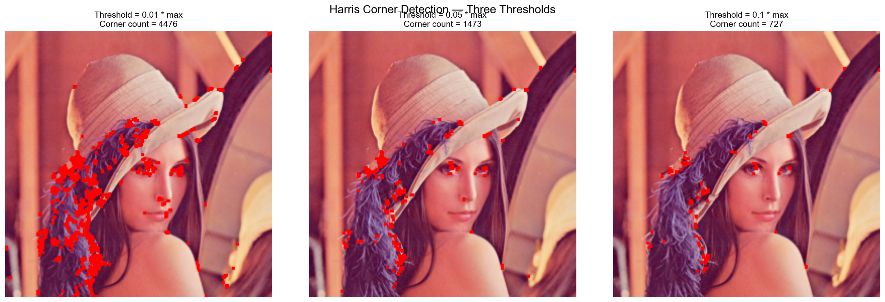

# 实验四：图像分割与特征描述 — 实验报告

---

## 一、实验详细操作步骤和程序清单

### 1.1 实验环境

| 项目         | 版本                  |
| ------------ | --------------------- |
| Python       | 3.10.18               |
| OpenCV (cv2) | 4.8.1                 |
| NumPy        | 1.26.4                |
| Matplotlib   | —                    |
| 操作系统     | macOS (Darwin 21.6.0) |

### 1.2 程序清单

| 文件                                | 说明                                     |
| ----------------------------------- | ---------------------------------------- |
| `实验四_图像分割与特征描述.ipynb` | Jupyter Notebook，包含全部实验代码和分析 |
| `实验报告.md`                     | 本实验报告                               |

### 1.3 生成的结果图片

| 文件名                              | 对应实验                                 |
| ----------------------------------- | ---------------------------------------- |
| `实验1_图1_阈值法与Canny.png`     | 实验1 — 图1 分割结果                    |
| `实验1_图2_Otsu与分水岭.png`      | 实验1 — 图2 分割结果                    |
| `实验1_图3_自适应阈值与Sobel.png` | 实验1 — 图3 分割结果                    |
| `实验2_颜色空间可视化.png`        | 实验2 — 三颜色空间通道可视化（使用图6） |
| `实验2_直方图.png`                | 实验2 — 各通道直方图（使用图6）         |
| `实验3_SIFT匹配连线图.png`        | 实验3 — SIFT 特征匹配连线               |
| `实验3_Harris角点检测.png`        | 实验3 — Harris 角点检测（三阈值对比）   |

### 1.4 操作步骤

**实验1 — 图像分割**

1. 读取图1（低对比度医学图像），转为灰度图
2. 使用 `cv2.adaptiveThreshold`（Gaussian 方法，blockSize=11, C=2）进行自适应阈值分割
3. 使用 `cv2.Canny`（threshold1=50, threshold2=150）进行边缘检测
4. 将 Canny 边缘（红色）叠加到自适应阈值结果上
5. 读取图2（自然场景图像），转为灰度图
6. 使用 `cv2.threshold` + `THRESH_OTSU` 进行 Otsu 全局阈值二值化
7. 基于 Otsu 结果，依次进行形态学开运算（去噪）、膨胀（确定背景）、距离变换、阈值化（确定前景）、连通组件标记，最后应用 `cv2.watershed`；在分水岭结果上以红色标记分割边界
8. 读取图3（不均衡曝光图像），转为灰度图
9. 使用 `cv2.adaptiveThreshold`（Gaussian 方法，blockSize=15, C=3）进行局部自适应阈值分割
10. 使用 `cv2.Sobel`（ksize=3）计算 x 和 y 方向梯度，合成梯度幅值图
11. 使用 `plt.subplots` 并排显示原图和两种分割结果，保存图片

**实验2 — 全局特征提取**

1. 读取图6（自然场景彩色图像）
2. 将 BGR 图像转换为 RGB、HSV、Lab 三种颜色空间
3. 分别计算各颜色空间各通道的均值（mean）和标准差（std）
4. 使用 `cv2.calcHist` 计算各通道 256-bin 直方图
5. 使用 `plt.subplots` 以 3×4 布局可视化三种颜色空间的各通道图像
6. 以 3×3 布局绘制各通道直方图

**实验3 — 局部特征提取**

1. 读取图4（标准Lena）和图5（旋转缩放后的Lena）
2. 创建 `cv2.SIFT_create()`，检测两幅图的关键点和描述符
3. 使用 `cv2.BFMatcher` + `knnMatch(k=2)` 进行暴力匹配
4. 应用 Lowe's ratio test（NNDR < 0.7）筛选高质量匹配
5. 使用 `cv2.findHomography` + RANSAC 计算单应性矩阵，统计内点数，计算正确率（内点数 / 筛选匹配数）
6. 使用 `cv2.drawMatches` 绘制匹配连线图（只绘制内点）
7. 对图4使用 `cv2.cornerHarris`（blockSize=2, ksize=3, k=0.04）进行角点检测
8. 分别设置阈值系数 0.01、0.05、0.1，以 `plt.subplots` 并排显示三种阈值下的角点结果

---

## 二、实验结果

### 2.1 实验1：图像分割

**图1（低对比度医学图像）**

| 算法                               | 效果描述                                                                               |
| ---------------------------------- | -------------------------------------------------------------------------------------- |
| 自适应阈值法（Gaussian, block=11） | 能有效提取低对比度区域的局部结构，对背景噪声有一定抑制。分割结果保留了图像的细节纹理。 |
| Canny 边缘检测                     | 提取了清晰的边缘轮廓，双阈值机制有效抑制了弱边缘和噪声，边缘定位较为精确。             |

叠加显示中，红色 Canny 边缘覆盖在自适应阈值二值图上，可直观对比两种算法的互补性：阈值法提供了区域分割，Canny 提供了边界定位。

**图2（自然场景图像）**

| 算法            | 效果描述                                                                                           |
| --------------- | -------------------------------------------------------------------------------------------------- |
| Otsu 全局阈值法 | 自动确定阈值，将前景与背景有效分离。由于图像整体光照较均匀，Otsu 表现良好。                        |
| 分水岭算法      | 基于距离变换和形态学预处理，进一步细分了 Otsu 得到的连通区域，红色边界线标出了不同区域的分割边界。 |

分水岭在 Otsu 二值化基础上进一步分离了粘连物体，但预处理参数（开运算迭代次数、前景阈值系数）直接影响分割粒度。

**图3（不均衡曝光图像）**

| 算法                                 | 效果描述                                                                           |
| ------------------------------------ | ---------------------------------------------------------------------------------- |
| 局部自适应阈值（Gaussian, block=15） | 在曝光不均的不同区域，局部窗口能自适应调整阈值，暗区和亮区的细节均得到了较好保留。 |
| Sobel 边缘检测                       | 检测到明显的梯度边缘，对渐变区域响应较好，但弱边缘细节不如 Canny 丰富。            |

自适应阈值有效克服了不均衡曝光对全局阈值法的限制；Sobel 边缘能反映图像的梯度结构，但对噪声较敏感。

### 2.2 实验2：全局特征提取

**统计数据**：

| 颜色空间 | 通道 | 均值   | 标准差 |
| -------- | ---- | ------ | ------ |
| RGB      | R    | 128.76 | 75.81  |
| RGB      | G    | 131.51 | 78.76  |
| RGB      | B    | 132.68 | 88.32  |
| HSV      | H    | 73.54  | 42.99  |
| HSV      | S    | 61.31  | 57.46  |
| HSV      | V    | 142.88 | 82.43  |
| Lab      | L    | 135.78 | 80.12  |
| Lab      | a    | 127.74 | 7.43   |
| Lab      | b    | 127.76 | 11.75  |

**分析**：

RGB 三个通道均值接近（R≈129, G≈132, B≈133），蓝色通道的标准差最大（88.32），表明图像中蓝色分量变化最丰富。HSV 空间中有明显的色调（H=73.54，偏黄绿区域）和饱和度（S=61.31），说明图像包含较丰富的色彩信息。Lab 空间中 a 和 b 通道的均值接近 128，但标准差（a: 7.43, b: 11.75）表明存在一定的色彩偏移。

HSV 将色彩与亮度解耦，H 通道对光照变化具有不变性，适合颜色识别和检索任务；Lab 具有感知均匀性，适合颜色差异度量。对于该自然场景图像，HSV 和 Lab 均比 RGB 更适合颜色特征提取，因为 RGB 三通道高度相关，受光照变化影响大。

### 2.3 实验3：局部特征提取

**SIFT 特征匹配**：

| 指标                       | 数值   |
| -------------------------- | ------ |
| 图4 关键点数量             | 339    |
| 图5 关键点数量             | 156    |
| Lowe's ratio test 后匹配数 | 68     |
| RANSAC 内点数              | 62     |
| 匹配正确率                 | 91.18% |

图4和图5之间存在旋转和缩放变换，SIFT 的尺度不变性和旋转不变性使其能够在变换后的图像中仍找到大量正确匹配，91.18% 的正确率表明 SIFT 描述符在该场景下具有良好的鲁棒性。

**Harris 角点检测**：

| 阈值系数    | 角点数量 |
| ----------- | -------- |
| 0.01 × max | 4476     |
| 0.05 × max | 1473     |
| 0.10 × max | 727      |

随着阈值升高，角点数量显著减少。低阈值（0.01）检测出大量弱角点（含噪声），分布密集；中阈值（0.05）在数量和精度之间取得较好平衡；高阈值（0.1）仅保留最强角点，集中于 Lena 的眼睛、帽檐等纹理丰富的区域。

**Harris 与 SIFT 对比**：

| 特性       | Harris             | SIFT                |
| ---------- | ------------------ | ------------------- |
| 尺度不变性 | 无                 | 有（DoG 金字塔）    |
| 旋转不变性 | 无                 | 有（主方向分配）    |
| 特征点密度 | 密集               | 稀疏                |
| 计算效率   | 高                 | 较低                |
| 描述符     | 无（仅位置）       | 128维梯度方向直方图 |
| 典型应用   | 角点检测、光流跟踪 | 图像匹配、目标识别  |

---

## 三、疑难小结

### 3.1 遇到的问题及解决方法

1. **分水岭过分割问题**：分水岭算法对噪声敏感，容易产生过分割。解决方法是在分水岭前加入形态学开运算去噪，并通过距离变换后的阈值系数（0.4 × max）控制前景标记的粒度。
2. **f-string 引号冲突**：在 Python 3.10 中，f-string 内部使用与外部相同的引号会导致语法错误（如 `f'{'='*45}'`）。解决方法是将表达式提取为变量，或使用不同引号。
3. **图6为彩色大图的处理**：图6自然图像.jpg 文件较大（约 7.9MB），首次加载时需注意内存占用。实验过程中切换从图2到图6，由灰度变为彩色，使颜色空间分析的结果更具实际意义。
4. **中文标题在 Matplotlib 中显示为方框**：通过设置 `plt.rcParams['font.sans-serif']` 指定字体解决。macOS 上可用的中文字体包括 'Arial Unicode MS' 和 'Heiti SC'。
5. **SIFT 关键点数量差异**：图4（标准Lena, 339个关键点）与图5（旋转缩放后, 156个关键点）的关键点数量差异较大，这是因为旋转和缩放变换改变了图像的局部结构，部分特征区域可能因插值而退化。

### 3.2 心得体会

1. 图像分割算法的选择应与图像特性匹配：低对比度图像适合自适应阈值，光照均匀的图像适合 Otsu，曝光不均的图像适合局部自适应方法。不存在"最好"的算法，只有"最合适"的选择。
2. 颜色空间的选择取决于任务需求。RGB 在彩色场景下三通道高度相关，受光照影响大；HSV 和 Lab 将颜色与亮度分离，能提供更鲁棒的颜色特征，更适合颜色识别和度量任务。
3. SIFT 虽然计算复杂，但其尺度和旋转不变性在图像匹配中价值巨大。91.18% 的匹配正确率充分证明了 SIFT 的有效性。Harris 角点虽然简单快速，但缺乏不变性，适合对实时性要求高的应用。
4. 参数调优是图像处理中的重要环节。Harris 的阈值系数从 0.01 变化到 0.1，角点数量从 4476 降至 727，反映了阈值对特征稀疏程度的关键影响。
